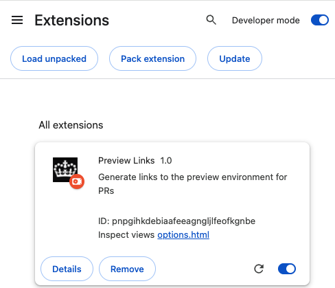
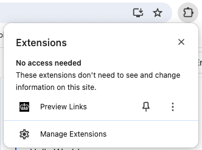
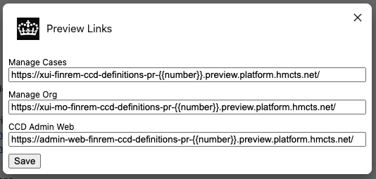
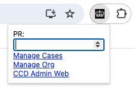

# preview-links
A [Chrome extension](https://developer.chrome.com/docs/extensions) to generate links to the preview environment for PRs.

It provides a convenient way to access
- Manage Cases
- Manage Organisation
- CCD Admin Web

## Install
The extension can be loaded in Chrome as an unpacked extension.

1. Clone this repository.
2. Go to **Manage Extensions** in Chrome `chrome://extensions/`.
3. Enable Developer Mode by clicking the toggle switch next to **Developer mode**.
4. Click the **Load unpacked** button and select the directory for this repository.

### Pin the extension
Pin your extension to the toolbar to quickly access it.

## Configuration
Before using the extension you must configure it for your service. You will need to know what URLs are used for a PR.

For example, in Financial Remedy the URLs are

| Application         | URL                                                                                  |
|---------------------|--------------------------------------------------------------------------------------|
| Manage Cases        | `https://xui-finrem-ccd-definitions-pr-{{number}}.preview.platform.hmcts.net/`       |
| Manage Organisation | `https://xui-mo-finrem-ccd-definitions-pr-{{number}}.preview.platform.hmcts.net/`    |
| CCD Admin Web       | `https://admin-web-finrem-ccd-definitions-pr-{{number}}.preview.platform.hmcts.net/` |

To configure the extension, right-click on its icon and select **Options** from the menu.

You should see a popup with inputs for each of the application. Add your own URLs and click **Save**.

**You must replace the PR number with `{{number}}`** 

## Usage
Click the extension's icon. You should see a popup.

Input the PR number. If you hit Enter then Manage Cases will open automatically. Alternatively, click the link for the 
application you wish to use. 

The extension will remember the last PR you entered.

